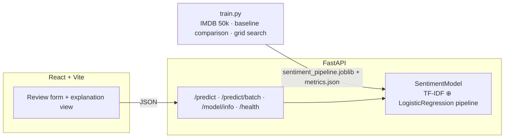

# Sentiment Analysis — explainable ML, end to end

[](https://github.com/soodkr3/Sentiment-Analysis/actions/workflows/ci.yml)

A full-stack sentiment classifier trained on the real **IMDB 50k review
dataset**, with a property most ML demos lack: **every prediction is exactly
explainable**. The API doesn't just return "negative, 99%" — it returns the
precise per-token contributions that produced that score, and the UI renders
them.

```
negative (99.1%)   dull −2.02   redeeming −1.33   lifeless −0.60   redeeming quality −0.49
```

## Honest numbers

All metrics are computed on a 9,917-review held-out test set the model never
saw (details and methodology in the [model card](backend/MODEL_CARD.md)):

| Model | Accuracy | F1 | ROC-AUC |
|---|---|---|---|
| Multinomial Naive Bayes baseline | 88.7% | 0.887 | 0.954 |
| **TF-IDF + Logistic Regression (shipped)** | **91.3%** | **0.914** | **0.971** |

5-fold CV on the training split agrees (91.1% ± 0.1%), and the metrics file is
regenerated by the training script — nothing is hand-typed. The model card
also documents *why* a linear model was chosen over a transformer, and the
failure modes (sarcasm, long-range negation, domain shift) found during error
analysis.

## Architecture



Key design choices (full rationale in the [model card](backend/MODEL_CARD.md)):

- **One `Pipeline` artifact** — vectorizer and classifier are saved together
  and share one preprocessing function between training and serving, so
  training/serving skew is impossible by construction.
- **Negation handled by bigrams, not stop-word lists** — "not good" scores
  −2.1 even though "good" alone is +0.8.
- **Exact explainability** — for a linear model, the logit is literally the
  sum of (tf-idf weight × learned coefficient) per token. The API returns the
  top contributors with every prediction; no approximation (LIME/SHAP) needed.

## Quickstart

### Backend

```bash
cd backend
python -m venv venv && source venv/bin/activate
pip install -r requirements.txt
uvicorn app:app --reload          # serves the committed trained model
```

Interactive API docs: http://localhost:8000/docs

To retrain from scratch (downloads the dataset on first run, ~5 min):

```bash
python train.py            # full 50k reviews
python train.py --sample 5000   # quick balanced subsample
```

### Frontend

```bash
cd frontend
npm install
npm run dev                # http://localhost:5173
```

Point it at a non-default API with `VITE_API_URL=https://my-api npm run dev`.

### Docker

```bash
cd backend
docker build -t sentiment-api .
docker run -p 8000:8000 sentiment-api
```

## API

```bash
curl -X POST localhost:8000/predict \
  -H 'Content-Type: application/json' \
  -d '{"text": "A dull, lifeless film with not a single redeeming quality."}'
```

```json
{
  "sentiment": "negative",
  "confidence": 0.9907,
  "probabilities": { "negative": 0.9907, "positive": 0.0093 },
  "top_features": [
    { "token": "dull", "weight": -2.024 },
    { "token": "redeeming", "weight": -1.334 },
    { "token": "lifeless", "weight": -0.596 }
  ]
}
```

| Endpoint | Description |
|---|---|
| `POST /predict` | Single prediction with confidence and per-token explanation |
| `POST /predict/batch` | Up to 100 texts with summary statistics |
| `GET /model/info` | Training metadata and full evaluation metrics |
| `GET /health` | Liveness probe |

## Testing & CI

```bash
cd backend && pytest          # 15 tests: preprocessing, model, explainability, API
cd frontend && npx vitest run # component tests with a mocked API
```

GitHub Actions runs lint (ruff), both test suites, and the production frontend
build on every push. API tests train a tiny in-memory pipeline so they
exercise the real code paths without depending on the 2 MB artifact.

## Project structure

```
backend/
  sentiment/         # package: preprocessing + model wrapper with explainability
  train.py           # data download, baseline comparison, grid search, evaluation
  app.py             # FastAPI service
  tests/             # pytest suite
  artifacts/         # trained pipeline + metrics.json (regenerated by train.py)
  MODEL_CARD.md      # methodology, design decisions, limitations
frontend/
  src/               # React app: prediction form, confidence bars, token chips
```

## License

MIT
